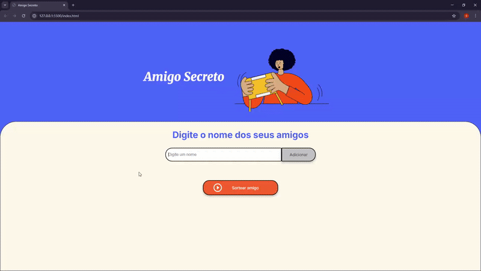

# 🎁 Challenge Amigo Secreto 

Este projeto foi desenvolvido como parte do programa da **Oracle Next Education** em parceria com a **Alura**.  
O desafio consistia em implementar a **lógica em JavaScript** para um site de **Amigo Secreto**, utilizando conhecimentos que adquiri nos cursos:
- Lógica de programação: mergulhe em programação com JavaScript
- Lógica de programação: explore funções e listas
- Git e GitHub: compartilhando e colaborando em projetos

---

## 💡 Como funciona o site

O site de **Amigo Secreto** permite que os usuários adicionem participantes e façam o sorteio de forma interativa.  

### 1️⃣ Adicionar participantes
- O usuário digita o nome de um participante no campo de input.  
- Ao clicar no botão "Adicionar", a função `adicionarAmigo()` é executada:  
  - Verifica se o campo não está vazio.  
  - Adiciona o nome à lista de participantes (`participantes[]`).  
  - Atualiza a lista visível de participantes na tela (`<ul>`).  
  - Limpa e foca novamente o campo de input para facilitar a digitação de novos nomes.  

### 2️⃣ Sortear o amigo secreto
- Ao clicar no botão "Sortear", a função `sortearAmigo()` é chamada:  
  - Verifica se a lista de participantes não está vazia.  
  - Calcula aleatoriamente um índice dentro do array `participantes` usando `Math.random()`.  
  - Exibe o resultado do sorteio na tela, mostrando o nome do **amigo secreto** sorteado.  
  - Limpa a lista de participantes e a lista visual (`<ul>`), permitindo iniciar um novo sorteio.  
  - O input é novamente focado para inserir novos participantes.  

### 3️⃣ Comportamento extra
- Alerts aparecem caso o usuário tente adicionar um nome vazio ou sortear sem participantes.  
- O input é constantemente focado para tornar a experiência rápida e fluida.  

---

## 🛠️ Tecnologias Utilizadas
- **HTML5** → Estrutura do site (fornecido no desafio).  
- **CSS3** → Estilização do site (fornecido no desafio).  
- **JavaScript (ES6+)** → Implementação da lógica de funcionamento.  

---

## 📸 Demonstração
Veja o site funcionando

